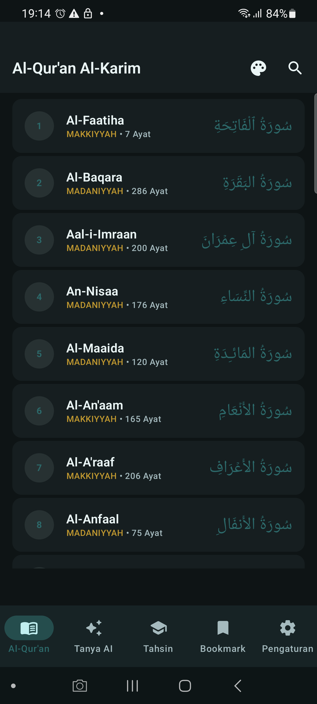
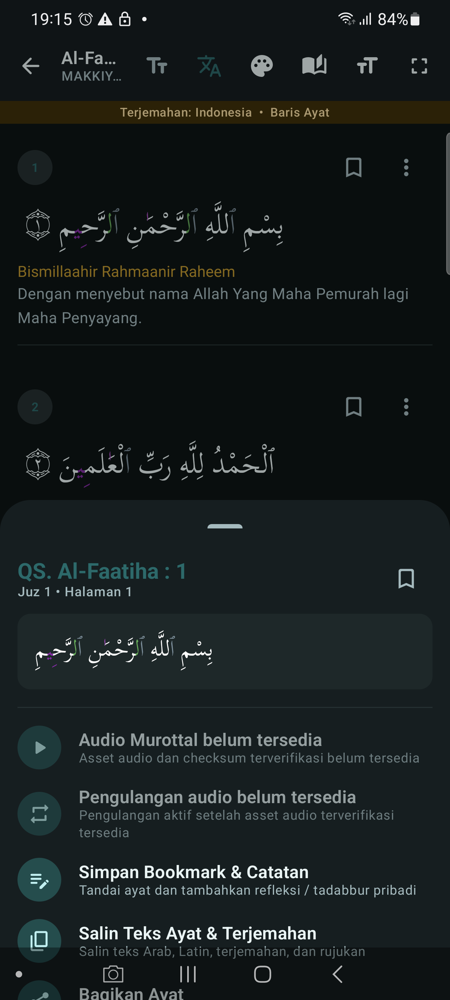
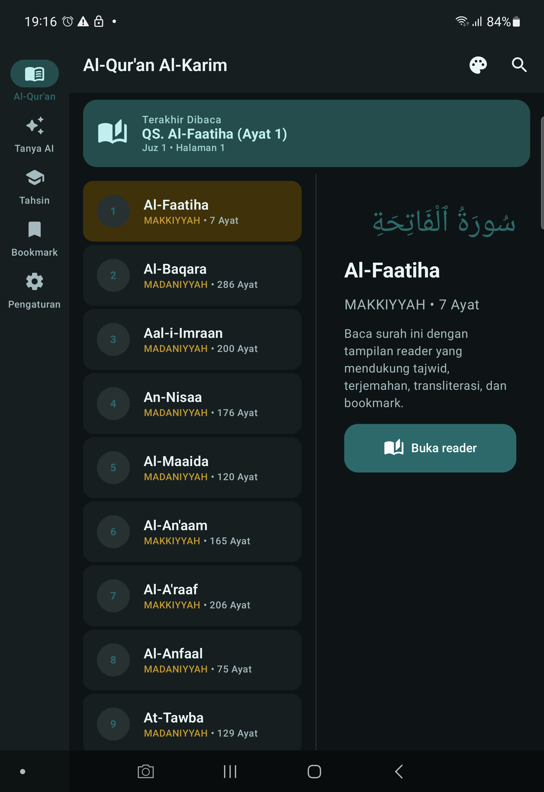
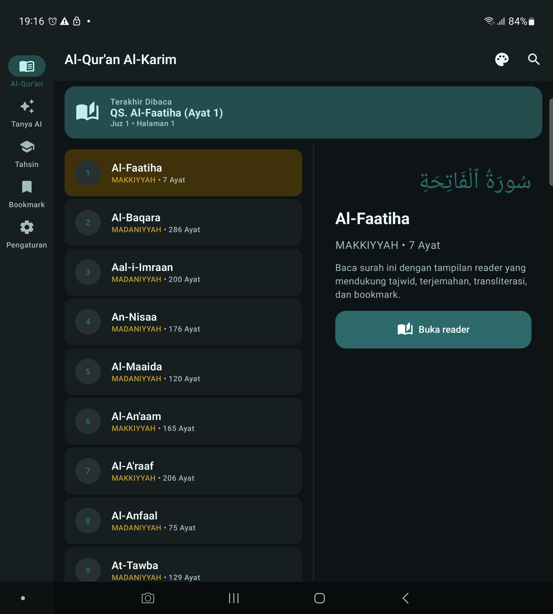
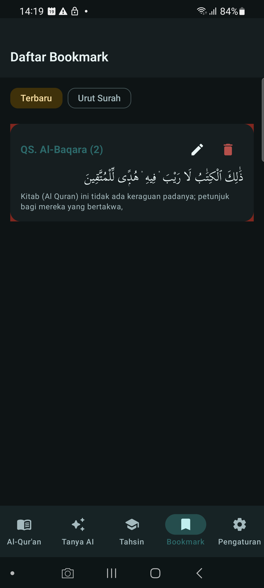
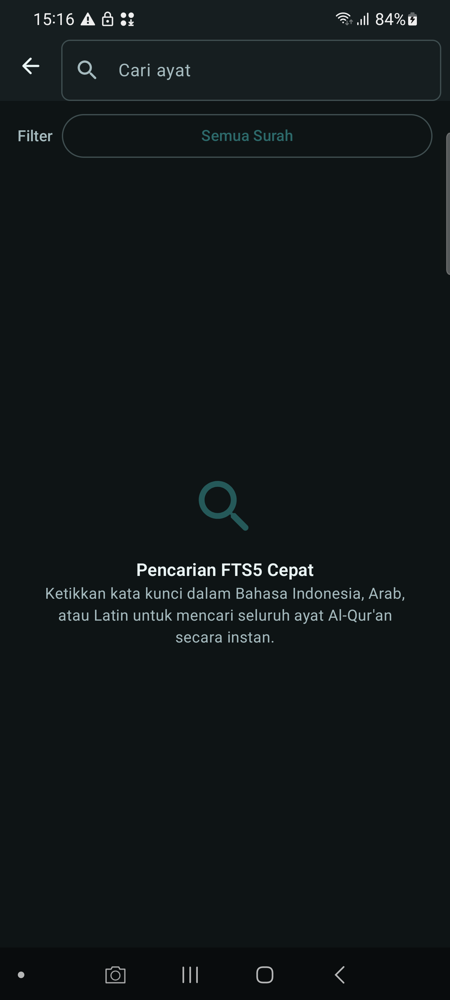
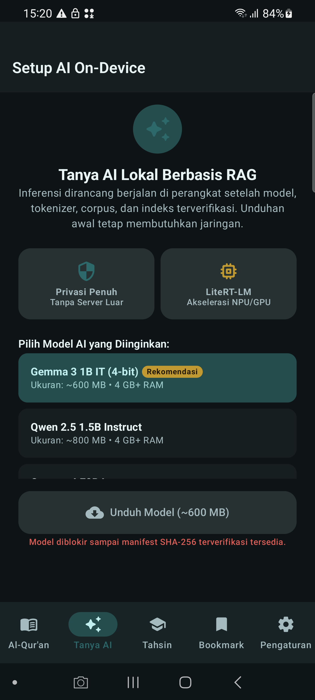
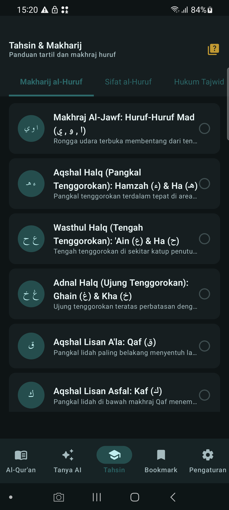
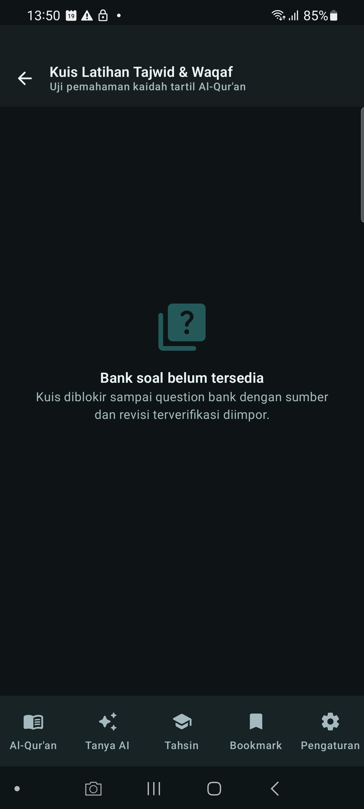
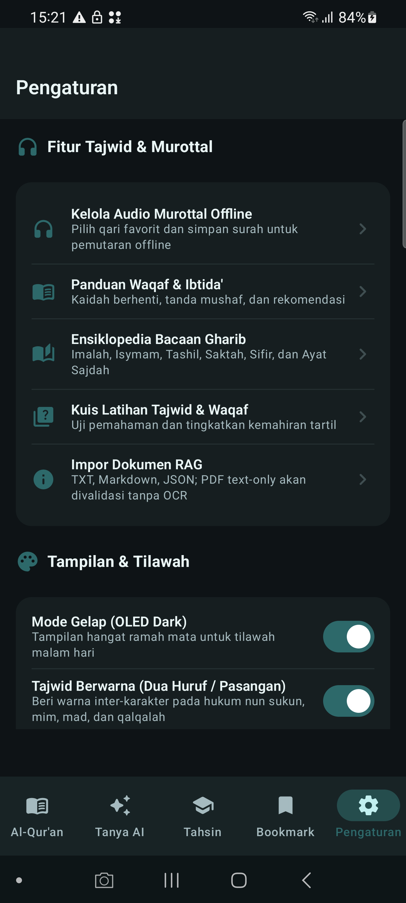

# Quran Plus

Android Quran reader built with Jetpack Compose, Clean Architecture, MVVM, and a small KMM `:shared` boundary.

Sprint 2 is under implementation and acceptance. This repository does not claim release completeness: any feature without verified source, model, index, audio asset, automated test, or physical-device evidence remains `partial` or `blocked`.

## Current scope

- Quran reader with Arabic text, translation, transliteration, Tajwid annotation, Waqaf parsing, search, bookmarks, notes, and exact last-read ayah state.
- Quran search uses FTS5 with Arabic/Latin/translation queries, an optional surah filter, and result highlighting; it has no `LIKE` fallback.
- Tahsin lessons backed by Room and exact Quran links.
- Material 3 adaptive navigation plus Quran list/detail panes for compact, medium, and expanded window classes.
- Local RAG pipeline contracts with fail-closed model, embedding, citation, and source states.
- SAF import validation for UTF-8 TXT, Markdown, and schema-validated JSON. PDF is rejected until a verified text extractor exists.

Hadith and thematic RAG records without a pinned source, license, grading, checksum, and compatible embedding index are not bundled. The previous unverified hadith/knowledge assets were removed from the APK path. A missing prerequisite produces an explicit blocked/error state; it never produces synthetic text, scores, vectors, confidence, or assistant replies.

## Sprint 2 traceability

Status is intentionally evidence-based. `blocked` is not treated as `complete`.

| ID | Status |
| --- | --- |
| F-01 | Partial: reader, exact ayah last-read with juz/page, page/juz navigation, immersive mode, and adaptive list/detail; landscape/accessibility/device matrix pending |
| F-02 | Partial: verified text, translation/transliteration, and 18–48sp font controls; word-level provenance pending |
| F-03 | Partial: ayah action wiring; verified audio asset gate pending |
| F-04 | Partial: 15-rule parser/annotation; corpus parity review pending |
| F-05 | Partial: token detail action is not released until granular source mapping is verified |
| F-06 | Partial: legend/catalog UI; source test pending |
| F-07 | Partial: Waqaf parser/UI; corpus evidence pending |
| F-08 | Partial: guidance UI; source attribution pending |
| F-09 | Blocked: Gharib record review and lineage pending |
| F-10 | Blocked: Media3 playback remains unavailable without a verified audio manifest/checksums |
| F-11 | Partial: resumable/checksum state machine; verified asset and worker tests pending |
| F-12 | Blocked: verified Room question bank pending |
| F-13 | Blocked: verified ONNX corpus/vector index/LiteRT model pending |
| F-14 | Partial: citation persistence and Quran deep-link codec/instrumentation pass; Hadith citations remain non-clickable until a valid target route exists |
| F-15 | Partial: persona DataStore restoration; device evidence pending |
| F-16 | Partial: Room lessons; source audit and device evidence pending |

Machine-readable contracts and provenance manifests are in `specs/` and `data/`. Internal project instructions, reference documents, screenshots used only for design review, archives, and extracted reference projects stay local and are excluded by `.gitignore`; they are not distribution assets.

## Architecture

```text
Compose screens + ViewModels
        |
Domain entities, use cases, repository contracts
        |
Room, FTS5, Media3, SAF, ONNX Runtime, LiteRT-LM adapters
```

- `:app` is the Android launcher and owns Android implementations.
- `:shared` contains the KMM-compatible Quran entities, repository contract, use cases, and shared `UiState`; Android adapters remain in `:app`.
- Koin provides dependency injection.
- State uses `StateFlow`; database access stays behind repositories/use cases.
- Quran search uses FTS5 only. There is no `LIKE` fallback.
- Model and downloader gates require verified SHA-256 and atomic `.tmp` replacement.
- RTK, CAVEMAN, and PONYTAIL are authoring guidance only, never runtime dependencies.

## Data and model requirements

- Bundled Quran asset: Room database with 114 surahs and 6,236 ayahs; the device gate must still validate migration and content at runtime.
- Hadith manifest: `data/hadith-provenance.json`; the local four-book audit is 24,065 records with file SHA-256 values, but corpus status is not distributable until source license, revision, schema, completeness, grading, and checksum gates pass.
- Hadith audit command: `rtk proxy powershell -NoProfile -Command ".\\scripts\\validate-hadith-reference.ps1 -AsJson"`; it reads the ignored local reference and never copies it into the APK or repository.
- RAG manifest: `data/rag-provenance.json`; no bundled hadith/knowledge vectors are claimed.
- Embeddings require a verified `all-MiniLM-L6-v2` ONNX model, matching tokenizer SHA-256, 384 dimensions, and a real sqlite-vec index. No model is bundled.
- LiteRT-LM model files are downloaded on demand only after a manifest provides a 64-character SHA-256. Current configurations intentionally remain blocked until those hashes are approved.
- User SAF documents are stored privately, hashed, chunked at 512 tokens with 50-token overlap, and remain separate from official Quran/Hadith sources.

## Build and verification

```powershell
rtk proxy .\gradlew.bat :shared:compileDebugKotlinAndroid
rtk proxy .\gradlew.bat :app:compileDebugKotlin
rtk proxy .\gradlew.bat :app:lintDebug
rtk proxy .\gradlew.bat :app:testDebugUnitTest
rtk proxy .\gradlew.bat :app:assembleDebug
rtk proxy .\gradlew.bat :app:assembleRelease
rtk proxy .\gradlew.bat :app:connectedDebugAndroidTest
rtk proxy python scripts/build_database.py  # expected fail-closed guard
```

Physical acceptance is separate from these gates. The current debug APK was installed and launched on Samsung SM-G988B (Android 13), `MainActivity` was resumed, the UI hierarchy was dumped, and the fatal-log check was clean. The latest connected instrumentation run completed 12/12 on SM-G988B. The Poco run is a separate gate and was blocked by `INSTALL_FAILED_USER_RESTRICTED`; it is not claimed as accepted. Accessibility, rotation, IME, 200% font, performance, audio, and RAG acceptance remain unproven.

## Preview evidence

The current adaptive previews were captured from the final debug APK with `adb exec-out screencap -p` on a Samsung `SM-G988B` (Android 13, 100% font scale). Compact is physical-device evidence; medium and expanded use reversible `wm size` overrides on the same device. The exact APK SHA, source commit, window class, and capture metadata are recorded in the [preview manifest](art/device-preview-manifest.json). They are smoke evidence, not proof of landscape, foldable, accessibility, performance, audio, or RAG release gates.

| Quran home | Reader | Ayah actions |
| --- | --- | --- |
|  |  |  |

| Compact | Medium adaptive pane | Expanded adaptive pane |
| --- | --- | --- |
|  |  |  |

| Historical bookmarks | Historical search | Historical chat model gate |
| --- | --- | --- |
|  |  |  |

| Historical Tahsin | Historical quiz blocked state | Historical settings |
| --- | --- | --- |
|  |  |  |

Machine-readable capture details: [`art/device-preview-manifest.json`](art/device-preview-manifest.json).

## Security and contribution rules

- Never restore or stage internal `docs*` directories, reference projects, archives, cache, model weights, secrets, or local instruction Markdown.
- Review `git diff --cached`, run secret scans, and stage an explicit allowlist. Do not use blind `git add .` in this data-heavy repository.
- Do not claim feature completion from browser previews, fake executors, static screenshots, or compile-only evidence.
- Source/license review is required before distributing Quran translations, hadith, audio, fonts, model files, or derived indexes.
- Release builds enable R8/resource shrinking, the manifest disables backup extraction, and audio/model download paths fail closed unless HTTPS, checksum, and provenance checks pass.

License and third-party attribution remain a release gate until verified source manifests are complete.
