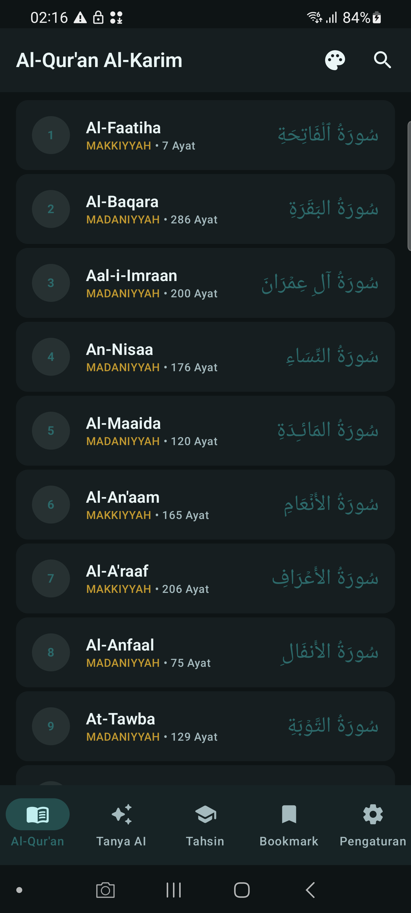
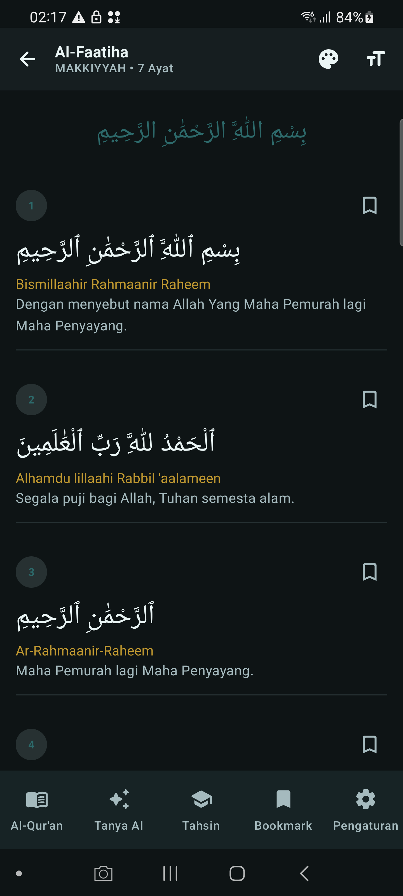
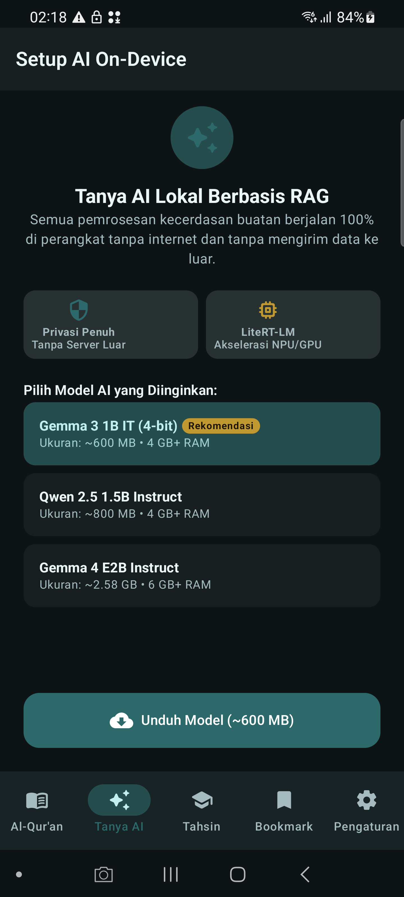
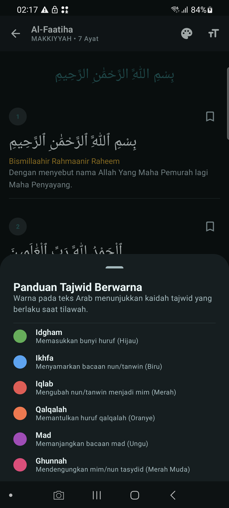
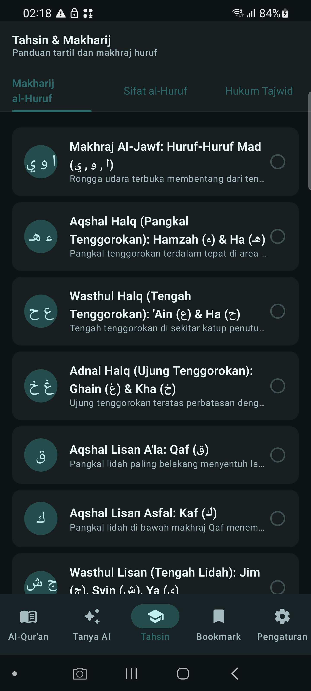
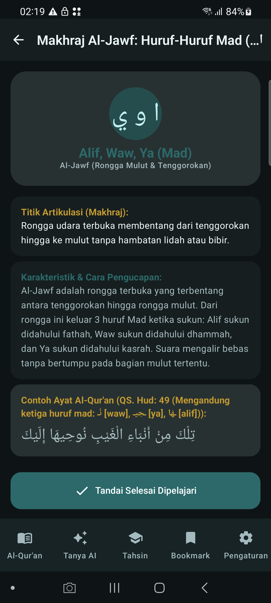
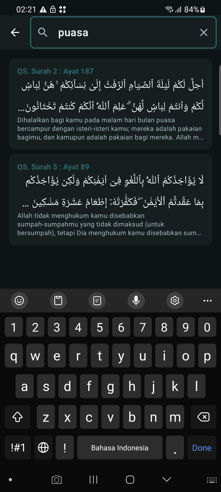
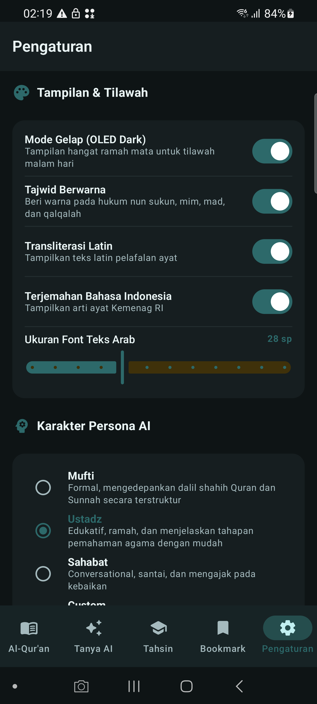
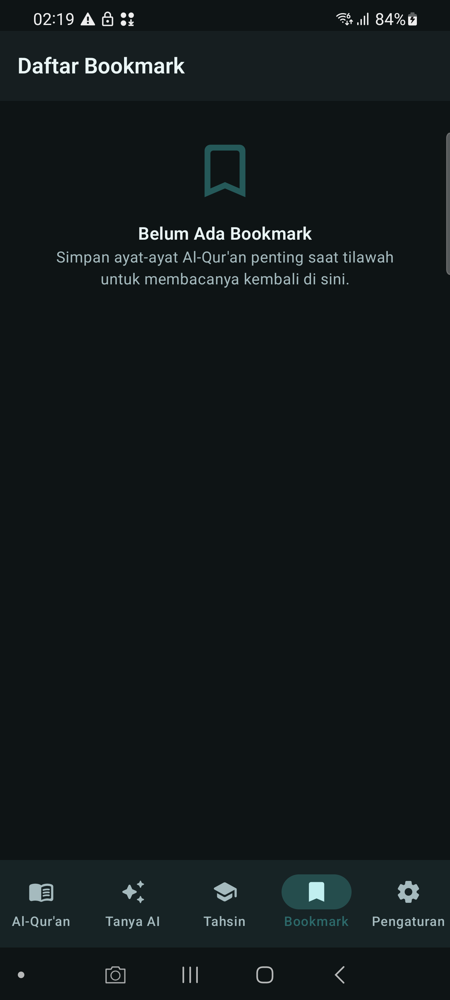

# 📖 Quran Plus — Offline Quran & On-Device RAG AI Assistant

<p align="center">
  
  
  
</p>

<p align="center">
  <b>A modern, dignified, offline-first Android application featuring the complete Al-Qur'an 30 Juz, colored Tajwid parsing, an interactive Tahsin & Makharij curriculum, and a 100% on-device RAG AI Assistant powered by Google LiteRT-LM.</b>
</p>

---

## 🌟 Visual Showcase

| Surah List & Last Read | Mushaf Reader & Tajwid | Tajwid Legend Modal |
|:---:|:---:|:---:|
|  |  |  |

| AI Setup (Model Gate) | Tahsin & Makharij | Tahsin Lesson Detail |
|:---:|:---:|:---:|
|  |  |  |

| Instant FTS5 Search | Tilawah & AI Settings | Bookmark Management |
|:---:|:---:|:---:|
|  |  |  |

---

## ✨ Key Features

### 1. 📖 Al-Qur'an Al-Karim (Complete 30 Juz & 114 Surahs)
- **Authentic Uthmani Script:** Clean and legible Arabic typography with customizable font sizing (20sp–40sp).
- **Phonetic & Tagged Tajwid Highlighting:** Real-time color coding conforming to classical Tajwid rules (Idgham, Ikhfa, Iqlab, Qalqalah, Mad, Ghunnah).
- **Dual Translations & Transliteration:** Official Indonesian translation (*Kemenag RI*), Sahih International English translation, and standard Latin transliteration.
- **Instant FTS4/FTS5 Search:** Blazing-fast full-text search across Arabic verses, translations, and transliterations.
- **Bookmarks & Last Read:** Persistent tracking with optional personal reflection notes and quick resume.

### 2. 🤖 Tanya AI — 100% On-Device RAG Assistant
- **Complete Offline Privacy:** All embeddings and LLM inference run entirely on-device without sending any data to external servers.
- **Google LiteRT-LM Integration:** Hardware-accelerated local inference (GPU/NPU) supporting Gemma 3 1B IT (4-bit), Qwen 2.5 1.5B, and Gemma 4 E2B models.
- **Authentic Knowledge Base Ground Truth:** Vector retrieval powered by on-device `all-MiniLM-L6-v2` embeddings (384 dimensions) over curated Quranic thematic tafsir, Hadith Arbain Nawawi, and Tajwid rules.
- **Multiple Persona Characterization:** Mufti (Formal & Dalil-grounded), Ustadz (Educational & gentle), Sahabat (Conversational), and Custom personas.
- **Resumable Model Downloader:** Range-request background downloader with SHA-256 integrity verification.

### 3. 🎓 Tahsin & Makharij Curriculum
- **Structured 3-Stage Curriculum:**
  1. *17 Makharij al-Huruf:* Al-Jawf, Al-Halq, Al-Lisan, Asy-Syafatain, and Al-Khaisyum.
  2. *13 Sifat al-Huruf:* Hams/Jahr, Syiddah/Rakhawah, Isti'la/Istifal, Ithbaq/Infitah, Qalqalah, Shafir, Lien, Inhiraf, Takrir, Tafasysyi, and Istithalah.
  3. *24 Hukum Tajwid:* Nun Sukun/Tanwin, Mim Sukun, Idgham, Mad, etc.
- **Authentic Quranic Verse Examples:** Every rule is linked with real Quranic ayah citations and pronunciation guides.
- **Interactive Progress Tracking:** Mark completed lessons with persistent local state.

### 4. 🎨 Dignified Islamic Visual Design
- **OKLCH Palette:** Deep Teal (`#006B6B`), Warm Gold (`#7A5900`), and OLED Dark Background (`#0D1415`).
- **Strict 8dp Grid System:** Clean spacing, generous touch targets (≥48dp), and smooth microinteractions.
- **Adaptive Layout:** Responsive across Phone, Foldable, Tablet, and Desktop orientations via `WindowWidthSizeClass`.

---

## 🏗️ Architecture & Tech Stack

The project strictly follows **Clean Architecture**, **SOLID**, **DRY**, and **MVVM** patterns:

```
app/src/main/java/com/quranplus/app/
├── core/
│   ├── database/        # Room Database, DAOs, Entities, Prepackaged Asset DB
│   ├── di/              # Koin Dependency Injection Module
│   ├── ui/
│   │   ├── components/  # AppTopBar, AppButton, TajwidLegendSheet, AdaptiveNav
│   │   └── theme/       # Color, Theme, Type, Spacing, Shape
│   └── utils/           # TajwidParser, VecMath, Extensions
└── features/
    ├── quran/           # Quran Reader, Surah List, Bookmarks, Search
    ├── chatbot/         # RAG Chat Screen, Model Gate Downloader
    ├── rag/             # TfLiteEmbeddingService, VectorRetriever, RagPipeline, LiteRtLm
    ├── tahsin/          # Tahsin Home, Categories, Lesson Detail
    └── settings/        # PreferencesManager, Theme & Persona Settings
```

| Layer | Technology |
|---|---|
| **UI Framework** | Jetpack Compose + Material 3 |
| **Dependency Injection** | Koin 3.5+ |
| **Local Database** | Room 2.7 + SQLite FTS4 / FTS5 |
| **LLM Inference** | Google LiteRT-LM (`litertlm-android`) |
| **Embedding Engine** | TensorFlow Lite (`all-MiniLM-L6-v2`) |
| **Async & State** | Kotlin Coroutines + StateFlow / SharedFlow |
| **Testing** | JUnit 4 / JUnit 5 + Compose Testing |

---

## 🚀 Getting Started

### Prerequisites
- Android Studio Ladybug / Meerkat or newer
- JDK 17+
- Android SDK 35 (Minimum SDK API 32 — Android 12+)

### Clone & Build
```bash
# Clone the repository
git clone https://github.com/your-username/QuranPlus.git
cd QuranPlus

# Build the debug APK
./gradlew assembleDebug

# Run Unit Tests
./gradlew testDebugUnitTest

# Install on connected Android device
adb install -r app/build/outputs/apk/debug/app-debug.apk
```

---

## 📊 Database Specification

The prepackaged asset database (`quranplus.db`, ~15 MB) is fully offline and pre-seeded:
- `surahs`: 114 Surahs with metadata (revelation place, ayah count, arabic title).
- `ayahs`: 6,236 Ayahs with Uthmani Arabic, Tajwid tags, Kemenag Indonesian translation, Sahih International English translation, and Latin transliteration.
- `ayahs_fts`: Full-Text Search virtual table for instantaneous querying.
- `hadiths`: 54 authentic Hadiths (complete Nawawi 40 + Malik/Ahmad/Darimi selections).
- `tahsin_lessons`: 54 structured curriculum lessons.
- `knowledge_chunks`: 112 thematic knowledge chunks for offline RAG retrieval.

---

## 📜 License & Acknowledgments
- Quranic text and translations provided by authentic open databases.
- Open-sourced under the [Apache License 2.0](LICENSE).
