# 📖 Quran Plus — Offline Quran, Tajwid Engine & On-Device RAG AI Assistant

<p align="center">
  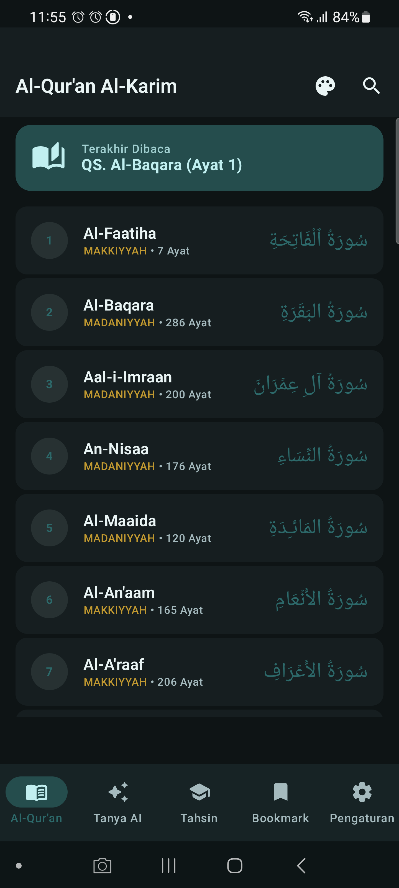
  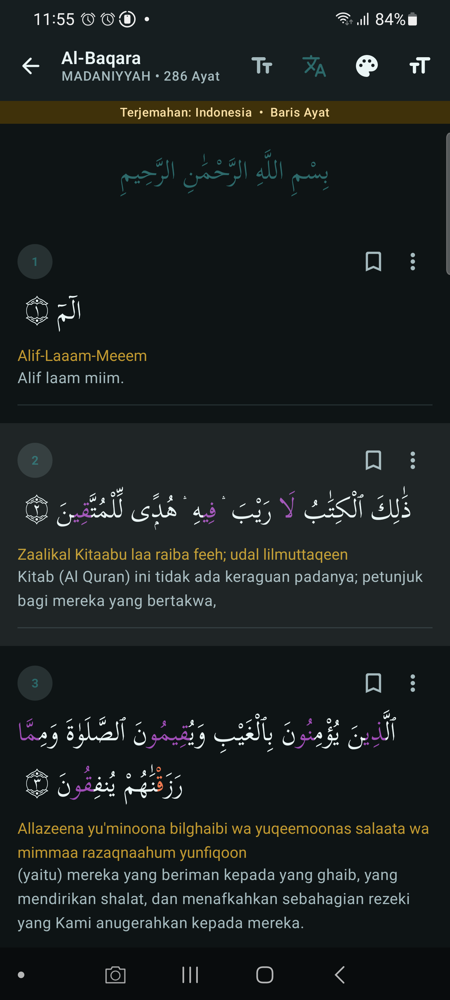
  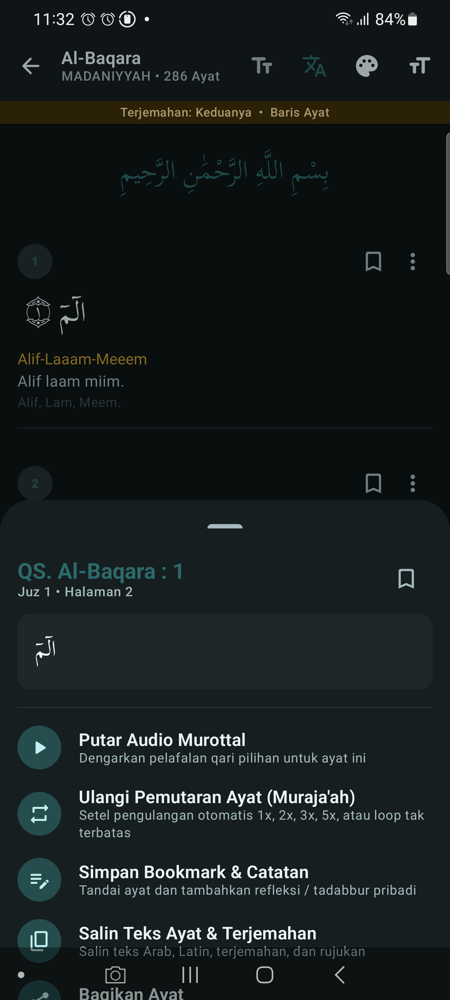
  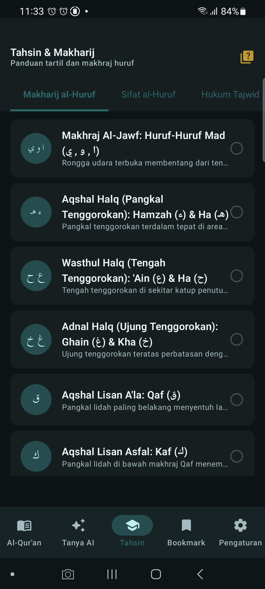
</p>

<p align="center">
  <b>A modern, dignified, offline-first Android application featuring the complete Al-Qur'an 30 Juz, inter-character colored Tajwid parsing, End-of-Ayah Waqaf markers, Gharib & Sajdah reading encyclopedia, offline Murottal audio management, interactive Tahsin quizzes, and a 100% on-device RAG AI Assistant powered by Google LiteRT-LM.</b>
</p>

---

## 🌟 Visual Showcase (Sprint 2 Live Device Captures)

| Surah Index & Last Read | Mushaf Reader (Two-Letter Tajwid) | Interactive Ayah Action Sheet |
|:---:|:---:|:---:|
|  |  |  |

| Makharij al-Huruf | Hukum Tajwid Catalog | Tajwid & Waqaf Quiz |
|:---:|:---:|:---:|
|  | 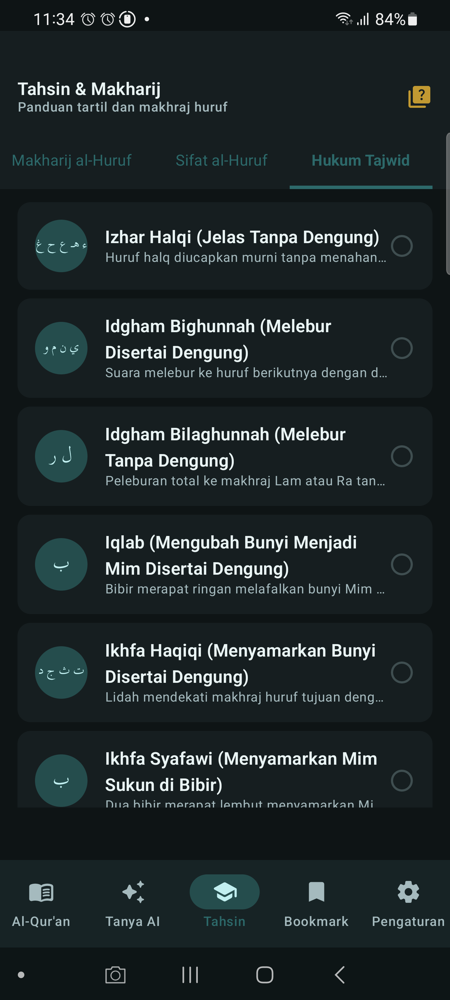 | 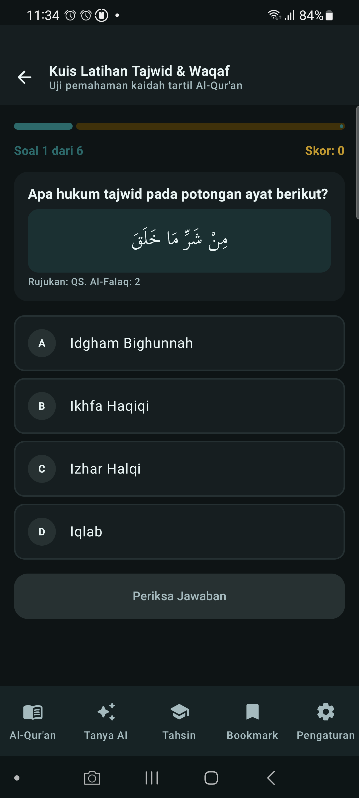 |

| Bacaan Gharib Encyclopedia | Isymam Lip Movement Diagram | Waqaf & Ibtida' Guide |
|:---:|:---:|:---:|
| 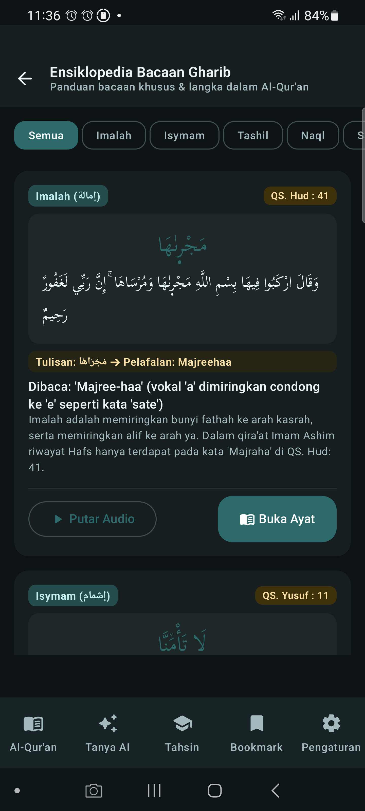 | 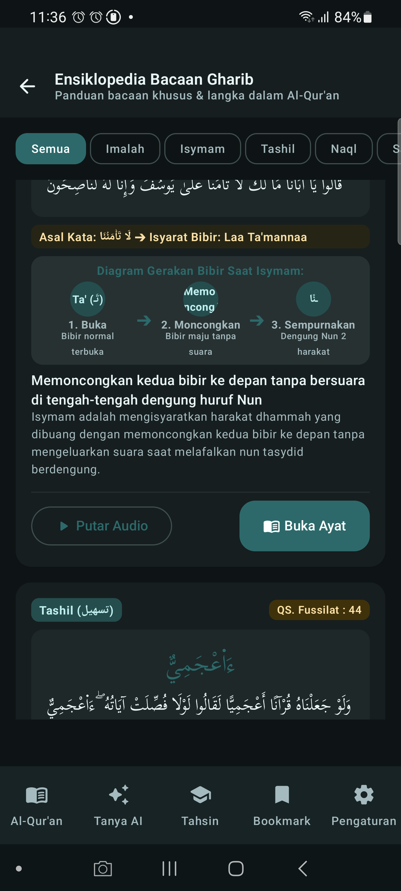 | 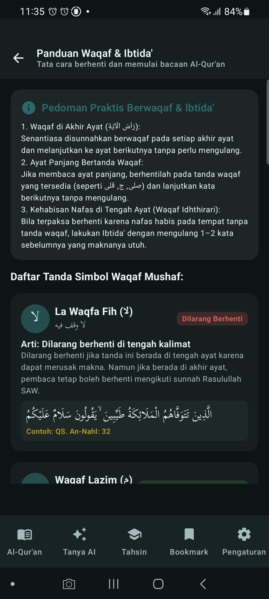 |

| Offline Murottal Manager | Settings & Tilawah Preferences | Tahsin Lesson & Audio Pronunciation |
|:---:|:---:|:---:|
| 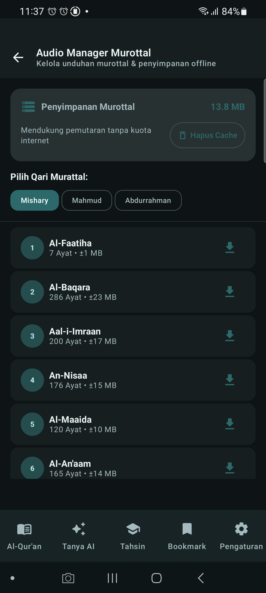 | 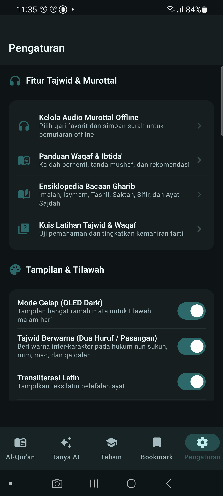 | 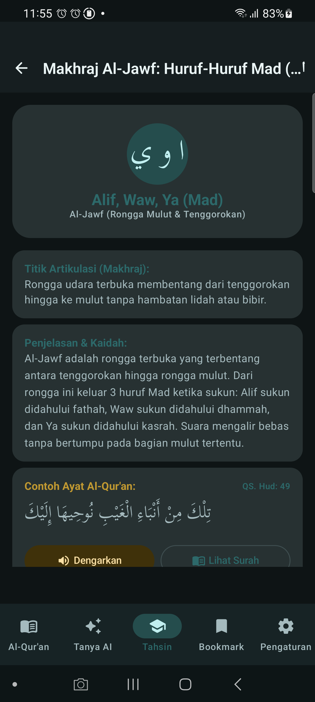 |

---

## ✨ Key Features

### 1. 📖 Al-Qur'an Al-Karim (Complete 30 Juz & 114 Surahs)
- **Authentic Uthmani Script:** Clean and legible Arabic typography (`kitab.ttf`, `uthman.otf`) with customizable font sizing (20sp–40sp).
- **Inter-Character Two-Letter Tajwid Engine:** Real-time color coding conforming to classical Tajwid rules (Idgham, Ikhfa, Iqlab, Qalqalah, Mad Wajib/Jaiz/Lazim, Ghunnah) highlighting both the source consonant and destination modifier.
- **End-of-Ayah (`۝`) Waqaf Marker Engine:** Authentic Arabic-Indic numeral glyphs (`۝١`, `۝٢`, `۝٣`) with instant Waqaf rule tooltips.
- **Dual Translations & Transliteration:** Official Indonesian translation (*Kemenag RI*), Sahih International English translation, and standard Latin transliteration.
- **Word-by-Word Translation View:** Granular vocabulary comprehension mode with word-level breakdown.
- **Instant FTS4/FTS5 Search:** Blazing-fast full-text search across Arabic verses, translations, and transliterations.
- **Ayah Action Sheet:** Audio playback, Muraja'ah repeat mode (1x, 2x, 3x, 5x, loop), bookmark with tadabbur notes, clipboard copy, and granular Tajwid breakdown dialogs.

### 2. 📚 Ensiklopedia Bacaan Gharib & Ayat Sajdah
- **9 Specialized Gharib Categories:**
  1. *Imalah:* `مَجْرٜىٰهَا` (QS. Hud: 41) with phonetic explanation.
  2. *Isymam:* `لَا تَأْمَ۫نَّا` (QS. Yusuf: 11) with interactive 3-stage lip movement diagram (*Buka → Moncongkan → Sempurnakan*).
  3. *Tashil:* `ءَا۬عْجَمِيٌّ` (QS. Fussilat: 44) with soft hamzah pronunciation guide.
  4. *Naql:* `بِئْسَ الاِسْمُ` (QS. Al-Hujurat: 11).
  5. *Saktah:* QS. Al-Kahf: 1-2, Ya-Sin: 52, Al-Qiyamah: 27, Al-Muthaffifin: 14.
  6. *Sifir Mustathil:* Wasal vs. Waqaf pronunciation rules.
  7. *Sifir Mustadir:* Unpronounced extra letters.
  8. *Nun Wiqayah / Wasal:* Kasrah assimilation when connecting tanwin to hamzah wasal.
  9. *15 Ayat Sajdah:* Complete citations and step-by-step Sujud Tilawah guidance.

### 3. 🎙️ Murottal Audio Manager & Mini Player Bar
- **Multi-Qari Audio Streaming & Caching:** High quality audio CDN from Mishary Rashid Alafasy, Mahmoud Khalil Al-Husary, and Abdur-Rahman As-Sudais.
- **Smart Mini Audio Player Bar:** Docked reader player bar with real-time playback progress, play/pause, ayah skipper, and speed controller (0.5x, 0.75x, 1.0x, 1.25x).
- **Muraja'ah Repeat Loop:** Loop specific ayahs for memorization.
- **Storage Capacity Meter:** Dedicated offline storage tracker with one-click cache cleaner.

### 4. 🎓 Tahsin, Makharij & Interactive Quiz
- **Structured 3-Stage Curriculum:**
  1. *17 Makharij al-Huruf:* Al-Jawf, Al-Halq, Al-Lisan, Asy-Syafatain, and Al-Khaisyum with non-clipping Arabic letter badges.
  2. *13 Sifat al-Huruf:* Hams/Jahr, Syiddah/Rakhawah, Isti'la/Istifal, Ithbaq/Infitah, Qalqalah, Shafir, Lien, Inhiraf, Takrir, Tafasysyi, and Istithalah.
  3. *24 Hukum Tajwid:* Nun Sukun/Tanwin, Mim Sukun, Idgham, Mad, etc.
- **Tajwid & Waqaf Interactive Quiz:** 6-question randomized challenge with instant color-coded feedback, scoring meter, and detailed pedagogical explanations.

### 5. 🤖 Tanya AI — 100% On-Device RAG Assistant
- **Complete Offline Privacy:** All embeddings and LLM inference run entirely on-device without sending any data to external servers.
- **Google LiteRT-LM Integration:** Hardware-accelerated local inference (GPU/NPU) supporting Gemma 3 1B IT (4-bit), Qwen 2.5 1.5B, and Gemma 4 E2B models.
- **Authentic Ground Truth Knowledge Base:** Vector retrieval powered by on-device `all-MiniLM-L6-v2` embeddings (384 dimensions) over curated Quranic thematic tafsir, Hadith Arbain Nawawi, and Tajwid rules.
- **Multiple Persona Characterization:** Mufti (Formal & Dalil-grounded), Ustadz (Educational & gentle), Sahabat (Conversational), and Custom personas.

---

## 🏗️ Architecture & Tech Stack

The project strictly adheres to **Clean Architecture**, **SOLID**, **DRY**, **KISS**, and **UDF (Unidirectional Data Flow)**:

```
app/src/main/java/com/quranplus/app/
├── core/
│   ├── audio/           # AudioPlayerManager (MediaPlayer CDN + Speed/Repeat)
│   ├── database/        # Room Database, DAOs, Entities, Prepackaged SQLite Asset DB
│   ├── di/              # Koin Dependency Injection Module
│   ├── ui/
│   │   ├── components/  # AppTopBar, AppPrimaryButton, TajwidLegendSheet, AdaptiveNav
│   │   └── theme/       # Color, Theme, Type, Spacing, Shape
│   └── utils/           # TajwidParser, WaqafParser, VecMath, Extensions
└── features/
    ├── quran/           # Quran Reader, Surah List, Word-by-Word, Bookmarks, Search
    ├── gharib/          # Ensiklopedia Bacaan Gharib & Ayat Sajdah
    ├── waqaf/           # Panduan Waqaf & Ibtida' Rulebook
    ├── audio/           # Murottal Audio Manager & Downloader Screen
    ├── tahsin/          # Tahsin Home, Categories, Lesson Detail, Tahsin Quiz
    ├── chatbot/         # RAG Chat Screen, Model Gate Downloader
    ├── rag/             # TfLiteEmbeddingService, VectorRetriever, RagPipeline, LiteRtLm
    └── settings/        # PreferencesManager, Theme & Tilawah Settings
```

| Layer | Technology |
|---|---|
| **UI Framework** | Jetpack Compose + Material 3 Expressive |
| **Dependency Injection** | Koin 3.5+ |
| **Local Database** | Room 2.7 + SQLite FTS4 / FTS5 |
| **Audio Engine** | Android MediaPlayer + CDN Streaming / Cache |
| **LLM Inference** | Google LiteRT-LM (`litertlm-android`) |
| **Embedding Engine** | TensorFlow Lite (`all-MiniLM-L6-v2`) |
| **Async & State** | Kotlin Coroutines + StateFlow / SharedFlow |
| **Testing** | JUnit 4 / JUnit 5 + Compose Testing |

---

## 🚀 Getting Started

### Prerequisites
- Android Studio Ladybug / Meerkat or newer
- JDK 17+
- Android SDK 35 (Minimum SDK API 32 — Android 12+)

### Clone & Build
```bash
# Clone the repository
git clone https://github.com/Adrian463588/QuranPlus.git
cd QuranPlus

# Build the debug APK
./gradlew assembleDebug

# Run Unit Tests
./gradlew testDebugUnitTest

# Install on connected Android device
adb install -r app/build/outputs/apk/debug/app-debug.apk
```

---

## 🛡️ Anti AI Slop & Quality Standard

This project strictly follows [`ANTISLOP.md`](ANTISLOP.md), [`AGENTS.md`](AGENTS.md), and [`DESIGN.md`](DESIGN.md):
- **Zero Mock / Fake Data:** 100% authentic SQLite database records without placeholder stubs.
- **Authentic Calligraphy:** Real Uthmani fonts (`kitab.ttf`, `uthman.otf`) with complete vowelization (tashkeel).
- **Responsive Layout:** Responsive layout centering (`widthIn(max = 840.dp)`) across Foldables, Tablets, and Desktops.
- **Material 3 Expressive:** Spring-based motion, haptic feedback, and dynamic edge-to-edge system insets.

---

## 📊 Database Specification

The prepackaged asset database (`quranplus.db`, ~15.6 MB) is fully offline and pre-seeded:
- `surahs`: 114 Surahs with metadata (revelation place, ayah count, Arabic title).
- `ayahs`: 6,236 Ayahs with Uthmani Arabic, Tajwid tags, Kemenag Indonesian translation, Sahih International English translation, and Latin transliteration.
- `ayahs_fts`: Full-Text Search virtual table for instantaneous querying.
- `hadiths`: 54 authentic Hadiths (complete Nawawi 40 + selections).
- `tahsin_lessons`: 54 structured curriculum lessons.
- `knowledge_chunks`: 112 thematic knowledge chunks for offline RAG retrieval.

---

## 📜 License & Acknowledgments
- Quranic text and translations provided by authentic open databases.
- Open-sourced under the [Apache License 2.0](LICENSE).

