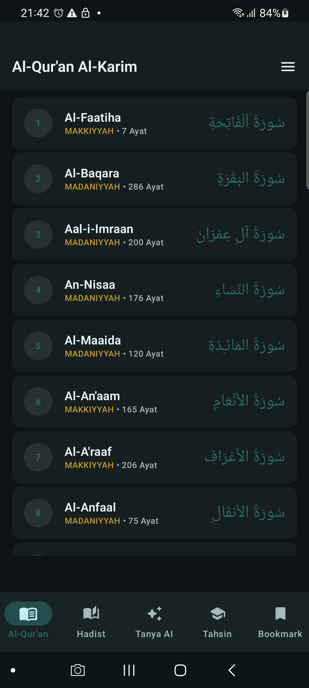
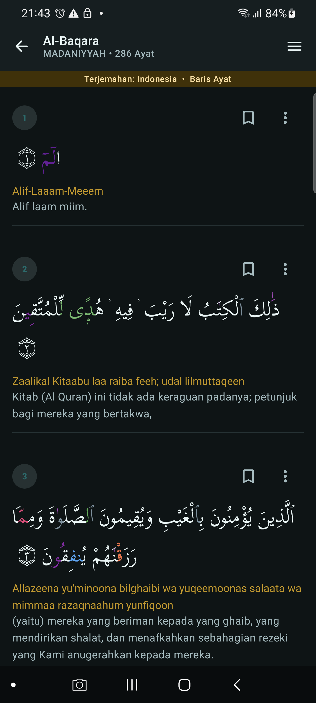
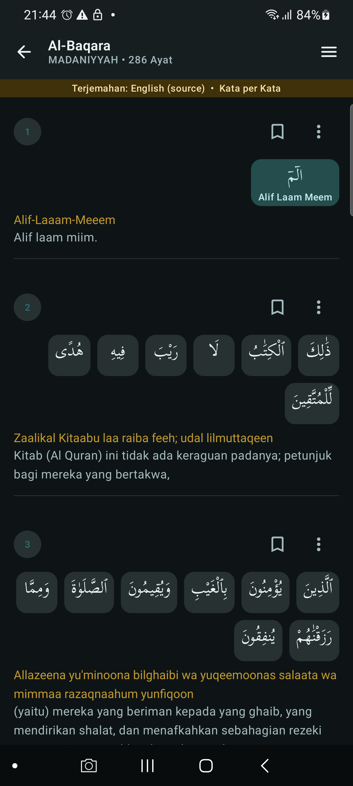
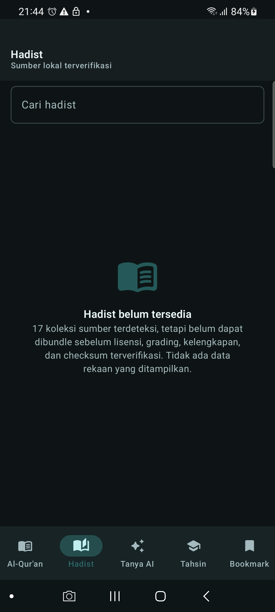
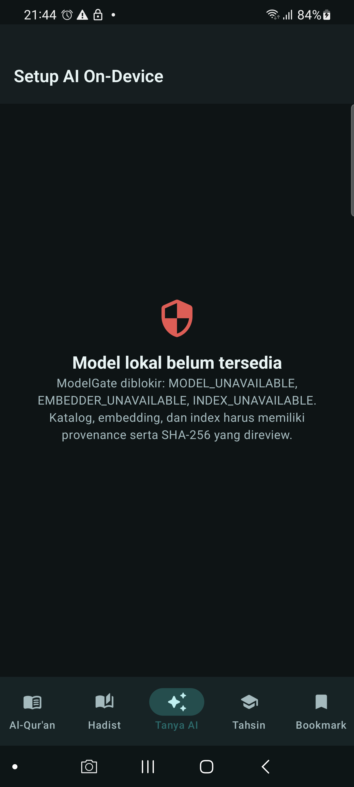
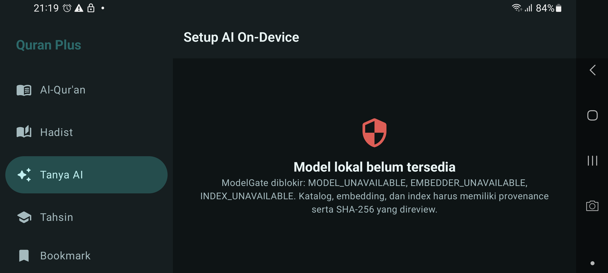
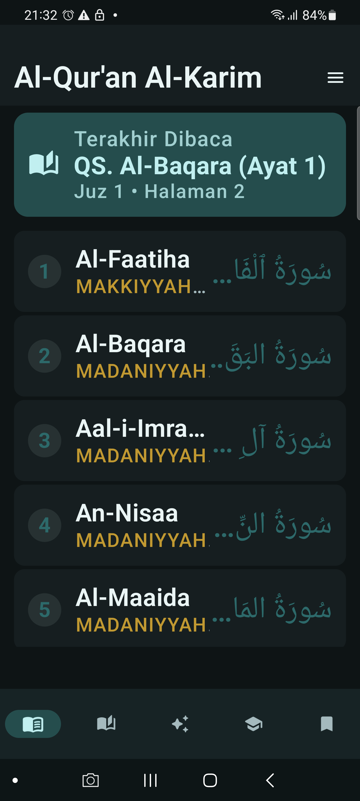
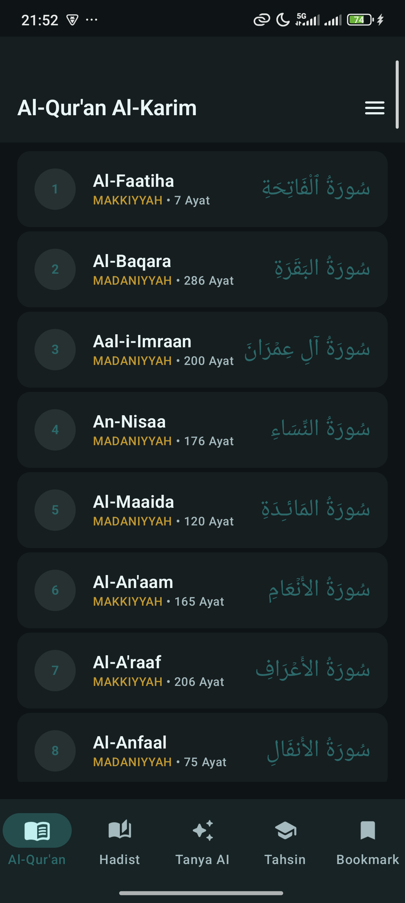

# Quran Plus

Quran Plus adalah aplikasi Android offline-first berbasis Jetpack Compose, Clean Architecture, MVVM, Room, FTS5, dan Koin. Status di bawah ini adalah status berbasis bukti; fitur tanpa sumber, checksum, model, index, atau acceptance device tetap ditampilkan sebagai `blocked`.

## Yang sudah diperbaiki

- Reader Quran minimal dengan back, judul/subjudul yang aman, dan satu hamburger menu.
- Tajwid dirender memakai `AnnotatedString` dan parser fail-closed untuk tag tidak dikenal/malformed.
- Katalog Waqaf terverifikasi untuk `لا`, `صلى`, `ج`, `م`, `قلى`, mu‘anaqah, saktah, dan marker akhir ayat yang dirender deterministik dari nomor ayat.
- Word-by-word Room berisi 77.430 baris untuk 6.236 ayat. Arabic dan English source ditampilkan; transliterasi, root, audio, dan Indonesian per-word tidak ditebak jika mapping/provenance belum valid.
- Bottom bar compact berisi lima slot: `Al-Qur'an`, `Hadist`, `Tanya AI`, `Tahsin`, dan `Bookmark`. Selected state, semantic role, dan target tap minimum 48dp diuji.
- Route Hadist, repository, use case, ViewModel, metadata koleksi, pencarian, citation fields, dan readiness gate sudah tersedia.
- Model/RAG memakai SAF sebagai source of truth untuk `QuranPlus/models/`, `QuranPlus/rag/source/`, `QuranPlus/rag/index/`, dan `QuranPlus/manifests/`. File memakai `.part`/`.tmp`, SHA-256, dan publish setelah verifikasi.
- AI tidak menghasilkan jawaban atau embedding ketika prerequisite tidak tersedia.

## Bukti data Quran

`python scripts/validate_quran_corpus.py app/src/main/assets/databases/quranplus.db` menghasilkan:

| Check | Hasil |
| --- | ---: |
| Surah | 114 |
| Ayat | 6.236 |
| Word-by-word | 77.430 |
| English source per-word | 77.430 |
| Indonesian per-word | 0, fail-closed karena alignment sumber tidak aman |
| Alignment/sequence failure | 0 |
| Marker akhir ayat yang dirender | 6.236 |

Teks sumber tidak menyimpan glyph `۝` di setiap baris; reader menambahkan `۝` dan digit Arab dari `ayah_number`, sehingga marker tidak diambil dari data rekaan.

## Hadist dan RAG

Reference lokal terdeteksi sebagai 17 koleksi dan 50.884 record. Audit terakhir menemukan 3.567 record tidak lengkap, tanpa duplicate ID atau invalid chapter reference. Lisensi dan record-level grading belum diverifikasi, sehingga `bundle_allowed=false`: database aplikasi hanya memuat metadata provenance 17 koleksi dan **0 teks hadist**. Tidak ada terjemahan Indonesia yang dibuat oleh aplikasi.

AI tetap `MODEL_UNAVAILABLE`, `EMBEDDER_UNAVAILABLE`, dan `INDEX_UNAVAILABLE` sampai manifest model, tokenizer, corpus, embedding ONNX 384-dimensi, dan sqlite-vec index nyata lolos checksum/provenance. Chunk contract adalah 512 token, overlap 50, dan top-k 5; tidak ada fallback scan Room yang menyamar sebagai vector retrieval.

Audit Hadist yang mengembalikan exit code 2 adalah guard yang diharapkan selama lisensi/kelengkapan belum lolos:

```powershell
powershell -NoProfile -ExecutionPolicy Bypass -File .\scripts\validate-hadith-reference.ps1 -AsJson
```

Manifest ringkas yang boleh masuk repository berada di [data/hadith-provenance.json](data/hadith-provenance.json). Raw reference, model weights, credential, dan dokumen internal tidak masuk APK atau GitHub.

## SAF dan model

Pengguna memilih folder melalui `ACTION_OPEN_DOCUMENT_TREE`. Aplikasi menyimpan persistable URI permission, membuat struktur berikut, memindai manifest saat relink, dan meminta relink bila permission hilang:

```text
QuranPlus/
├── models/
├── rag/source/
├── rag/index/
└── manifests/
```

Working cache internal boleh dibuat ulang setelah uninstall; model dan source RAG yang sudah dipublish tetap berada di folder SAF pengguna. Download memakai WorkManager, network constraint, resume/checksum, retry terbatas, dan tidak melakukan retry otomatis untuk kegagalan konfigurasi/storage.

## Arsitektur

```text
Compose UI + ViewModel
        ↓
Use case + domain contracts
        ↓
Room/FTS5 + SAF + ONNX/LiteRT adapters + sqlite-vec gate
```

`shared/commonMain` memuat kontrak KMM yang dibutuhkan; implementasi Android berada di `app`. RTK, CAVEMAN, dan PONYTAIL hanya authoring guidance sesuai `AGENTS.md`, bukan dependency runtime.

## Build dan test

```powershell
rtk proxy .\gradlew.bat :shared:compileDebugKotlinAndroid --no-daemon --console=plain
rtk proxy .\gradlew.bat :app:compileDebugKotlin --no-daemon --console=plain
rtk proxy .\gradlew.bat :app:testDebugUnitTest --no-daemon --console=plain
rtk proxy .\gradlew.bat :app:lintDebug --no-daemon --console=plain
rtk proxy .\gradlew.bat :app:assembleDebug --no-daemon --console=plain
rtk proxy .\gradlew.bat :app:connectedDebugAndroidTest --no-daemon --console=plain
```

Gate terakhir yang lolos:

- compile shared/app dan unit test: pass;
- lint debug dan debug assembly: pass;
- 13/13 Android instrumentation tests: pass pada Samsung SM-G988B, Android 13;
- 13/13 Android instrumentation tests: pass pada device `2412DPC0AG`, Android 15;
- APK debug terbaru di-install dan diluncurkan dengan `adb install -r` pada `RRCN3008VYE` dan `QSWSEMRKNFZ9LJRC`;
- DB runtime setelah upgrade: 6.236 ayat, 77.430 word rows, 17 hadist collection metadata, 0 hadist text;
- accessibility tree memverifikasi hamburger, bottom-bar five-slot, selected state, marker `۝`, mu‘anaqah `ۛ`, word selection, dan ModelGate blocker;
- landscape adaptive navigation dan font-scale 200% smoke pass pada Samsung.

TalkBack/IME journey, audio, model lokal nyata, corpus hadist distributable, embedding, dan sqlite-vec index tetap release blocker sampai prerequisite tersedia dan diuji.

## Preview aktual

Preview utama berikut diambil dari APK debug terbaru memakai `adb exec-out screencap -p` pada Samsung SM-G988B, Android 13, portrait, physical 1440×3200, density override 560. Metadata APK, waktu capture, route, dan responsive smoke tercatat di [art/device-preview-manifest.json](art/device-preview-manifest.json).

| Quran home | Reader Waqaf/Tajwid | Word-by-word selected |
| --- | --- | --- |
|  |  |  |

| Hadist blocked state | AI ModelGate |
| --- | --- |
|  |  |

Responsive/device evidence:

| Landscape adaptive navigation | Font scale 200% | Device smoke API 35 |
| --- | --- | --- |
|  |  |  |

Preview adalah smoke evidence, bukan bukti bahwa model, audio, lisensi hadist, atau semua device class sudah release-ready.

## Security

- Jangan stage `docs*`, reference project, raw model/embedding/index, archive, credential, atau local instruction Markdown.
- Review `git diff --cached`, jalankan `git diff --cached --check` dan secret scan sebelum commit/push.
- Jangan mengklaim completion dari screenshot, browser shell, mock executor, compile-only, atau data fabricated.
- Source/license review wajib dilakukan sebelum mendistribusikan Quran translation, hadist, audio, font, model, atau derived index.
