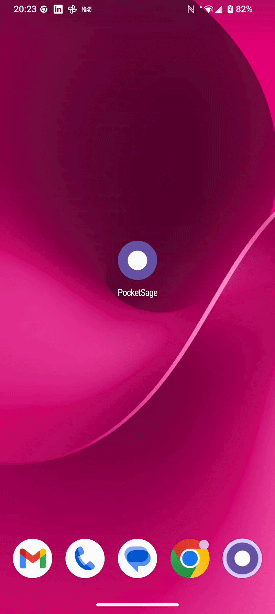

<div align="center">

# PocketSage

### Fully offline, on-device RAG for Android.
### 100% local, GDPR-compliant AI powered by LiteRT-LM.

[](LICENSE)
[](https://kotlinlang.org/)
[](https://developer.android.com/jetpack/compose)


<br/>

</div>

---

## Why PocketSage?

In an era of strict data privacy laws (GDPR/DSGVO), sending sensitive company documents to cloud LLMs is often a compliance risk. Legal contracts, internal reports, and financial records cannot simply be forwarded to a third-party API. PocketSage demonstrates how to build intelligent, grounded AI assistants that process proprietary PDFs entirely on edge hardware — ensuring **zero data leakage, zero cloud dependency, and zero compliance exposure**.

Beyond privacy, this project is a showcase of what modern Android engineering looks like when applied to a non-trivial problem. It combines clean layered architecture, production-quality dependency injection, streaming Kotlin Flows, and on-device ML inference into a single coherent codebase — the kind of integration work that separates senior Android engineers from the rest.

---

## Features

- 🔒 **Absolute Privacy** — No internet connection required after model setup. No API keys. No telemetry.
- 📄 **On-Device Document Parsing** — Import and chunk PDF text entirely on-device using `pdfbox-android`.
- 🧠 **Local Embeddings** — Generate 384-dimensional vector embeddings locally using LiteRT MiniLM.
- 🔎 **Vector Retrieval** — Top-K cosine similarity search over a Room-backed embedding store.
- ⚡ **Streaming LLM** — Generate grounded, token-streamed responses using Gemma 4 E2B Instruct via LiteRT-LM.
- 💬 **Transparent Sourcing** — The UI surfaces the exact document snippets used to construct each answer, making hallucinations visible and auditable.

---

## Architecture & Engineering Highlights

PocketSage follows Clean Architecture with three strictly separated layers:

```
UI (Jetpack Compose)
    └── ViewModels / StateFlows
          └── Domain (UseCases / RAG Pipeline)
                └── Data (Room · LiteRT · PDFBox · ModelRepository)
```

**Data Flow:**
```
PDF  ──►  Extract  ──►  Chunk  ──►  Embed  ──►  Room Store
                                                     │
                                               (cosine search)
                                                     │
User Query  ──►  Embed  ──────────────────────►  Retrieve
                                                     │
                                              Prompt Builder
                                                     │
                                             LiteRT-LM Engine
                                                     │
                                         Streaming Tokens  ──►  Compose UI
```

**Defensive Programming:**

- **Missing model** — A dedicated `ModelGate` composable intercepts navigation until the `.litertlm` file is provisioned. The engine is never initialised against an absent or partially-copied file.
- **Partial imports** — The model is first written to a `.tmp` file and only renamed to its final path once the copy completes, preventing a corrupted state from ever being treated as a valid model.
- **UI state management** — Each screen uses a `sealed interface UiState` (Idle / Loading / Success / Error) driven exclusively by `StateFlow`. Composables are stateless; all logic lives in ViewModels and UseCases.
- **Session lifecycle** — Each LLM `Session` is closed and nulled out in `awaitClose`, preventing double-close crashes on successive queries.
- **Error surfacing** — Generation failures write a human-readable error message directly into the assistant's chat bubble rather than silently leaving it empty.

---

## Tech Stack

| Layer | Choice | Why |
|---|---|---|
| UI | Jetpack Compose + Material 3 | Modern, declarative native Android UI |
| DI | Hilt 2.58 | Clean, compile-time dependency injection |
| Storage | Room 2.7.1 | Local structured persistence with BLOB support for embeddings |
| PDF parsing | `pdfbox-android` | Reliable on-device text extraction without network calls |
| Embeddings | LiteRT 1.4.0 | On-device embedding inference; Google's successor to TFLite |
| LLM Runtime | LiteRT-LM 0.10.2 (`litertlm-android`) | Highly optimised Android LLM inference for `.litertlm` models |
| Concurrency | Kotlin Coroutines + Flow | Async background processing and real-time token streaming |

---

## Model Details

PocketSage uses [`litert-community/gemma-4-E2B-it-litert-lm`](https://huggingface.co/litert-community/gemma-4-E2B-it-litert-lm) in `.litertlm` format — Google's LiteRT-LM native packaging for on-device inference.

**Why this model?**
Gemma 4 E2B Instruct delivers a strong balance between response quality and resource usage. It fits comfortably within the memory envelope of mid-range Android devices (~1.5 GB active footprint), handles instruction-following reliably, and produces coherent extractive answers from RAG-style prompts without requiring a full 7B+ parameter model.

**Deployment:** The model is **not bundled in the APK**. Bundling a ~2.58 GB file would make the app impossible to distribute through standard channels. Instead, PocketSage provisions the model once at first launch via the Storage Access Framework, copying it into app-private storage where it is isolated from other apps and removed automatically on uninstall.

---

## Quick Start

<details>
<summary>📽️ Watch the Library & import walkthrough</summary>
<br/>

</details>


### Option A — Install the APK

1. Go to the [**Releases**](../../releases) tab and download the latest `pocketsage.apk`.
2. Install it on a physical Android device (Android 12+, 4 GB+ RAM).

### Option B — Build from source

```bash
git clone https://github.com/umerdilpazir/pocketsage.git
cd pocketsage
./gradlew installDebug
```

### Download and provision the model

**Step 1 — Download the model to your phone**

Download [`gemma-4-E2B-it.litertlm`](https://huggingface.co/litert-community/gemma-4-E2B-it-litert-lm/resolve/main/gemma-4-E2B-it.litertlm?download=true) (~2.58 GB) directly to your phone's `Downloads` folder.

Or push it via ADB:
```bash
adb push gemma-4-E2B-it.litertlm /sdcard/Download/
```

**Step 2 — Import the model in-app**

Open PocketSage. The setup screen appears automatically when no model is present. Tap **Download model (2.58 GB)** to open the Hugging Face page, or tap **Pick file** to select a model you already downloaded. A progress bar tracks the secure copy into app-private storage.

**Step 3 — Add a PDF and start querying**

Go to the **Library** tab, tap **+** to import a PDF, and ask your first question once ingestion completes. Answers stream token by token with the source snippets shown beneath each response.

---

## Hardware Requirements & Constraints

| Requirement | Minimum |
|---|---|
| Android version | Android 12 (API 32) or higher |
| RAM | 4 GB+ recommended |
| Free storage | ~3 GB for the model file |
| CPU / GPU | Physical device required — emulators lack the hardware acceleration needed for on-device LLM inference |

**Additional notes:**

- `engine.initialize()` runs asynchronously on `Dispatchers.IO` and takes a few seconds on the first query depending on device hardware. A loading indicator covers this period.
- Response quality scales with device capability. Devices with a dedicated NPU or GPU may see noticeably faster inference.
- The cosine similarity search is brute-force in-memory over Room-stored embeddings — well-suited for thousands of document chunks; an ANN index would be needed at larger scale.

---

## License & Contact

This project is open-source under the [MIT License](LICENSE). You are free to fork, adapt, and build on it — attribution appreciated but not required.

Note that the Gemma model weights are subject to the [Gemma Terms of Use](https://ai.google.dev/gemma/terms) and the embedding model is licensed under Apache 2.0. Review both before shipping any derivative product.

---

<div align="center">

**Built by Umer Dilpazir**

[](https://linkedin.com/in/your-profile)

If PocketSage is useful to you or your team, a ⭐ helps others find it.

</div>